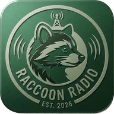

<div align="center">

<p></p>

# Raccoon Radio
### An internet radio app for Android, with live album art support.

[](./LICENSE)

<br>
<br>

</div>

## About this fork

Raccoon Radio is a fork of [**Acoustic**](https://github.com/themetalshard/acoustic-radio), created by
TheNextAtlas (formerly TheMetalShard) and the Steel Project, with thanks to NexGenDriven. Acoustic is a
great, simple internet radio app for Android - this fork exists to add one feature its upstream doesn't
have: **live album art**, sourced from a station's own metadata server rather than plain ICY text metadata.

All credit for the original app design, player, and UI goes to the upstream authors. This fork is
distributed under the same [MIT License](./LICENSE).

## Features

- Everything Acoustic does: M3U import/export, Android 5-16 support, ICY text metadata, browser URI for
  quick station adding
- **New:** optional per-station metadata endpoint for live track title/artist **and album art**, for
  stations whose broadcast setup can serve that data (see below)
- **New:** URI scheme updated to `raccoonradio://register` (the old `acoustic://register` links still work)

## Live album art

ICY metadata (what most internet radio streams provide) is text-only - station name and track title, no
artwork. To show real album art, Raccoon Radio polls an **optional** JSON endpoint you point a station at.

When adding or editing a station, fill in "Metadata Endpoint (optional)" with a URL that returns JSON like:

```json
{ "title": "Song Name", "artist": "Artist Name", "artUrl": "https://example.com/art.jpg" }
```

A few common key names are also accepted (`track`/`song` for title; `art`/`image`/`cover`/`art_url` for
artwork), so it should work with most simple metadata scripts without changes. Leave the field blank for
ordinary stations - they'll behave exactly as they do in upstream Acoustic, showing the static station icon
and ICY text metadata only.

The endpoint is polled roughly every 8 seconds while that station is playing.

## Verify app

This fork is unsigned/independently signed - the SHA256 signature published by the Steel Project for
Acoustic does **not** apply to Raccoon Radio builds. If you build via the included GitHub Actions workflow
with your own signing keystore, your APK's signature will be specific to your build.

# FAQ

### How does the URI work?

```
raccoonradio://register?name=Test Station&url=http://url.com/station.mp3&image=http://url.com/image.png&meta=http://url.com/metadata.json
```

`name`, `image`, and `meta` are all optional - only `url` is required. The legacy
`acoustic://register?...` form (without `meta`) also still works, for compatibility with existing
"add station" buttons built for upstream Acoustic.

### Which stream types are supported?

Same as upstream: MP3, AAC, and M3U8 HLS. Opus and others may work but are untested.

### Why isn't this signed the same as Acoustic / on F-Droid?

It's a personal fork with one added feature, published independently of the Steel Project. See
Installation below for how to build and, optionally, sign your own APK.

# Installation

This repo isn't yet published to F-Droid/OpenAPK. To get an APK:

### Option A - GitHub Actions (recommended)

Every push to `main` builds a debug APK automatically (see **Actions -> Build APK -> Artifacts**). Pushing a
tag like `v1.0.0` also builds a release APK. By default the release build is **unsigned**; to get a signed
release APK, add these repository secrets under **Settings -> Secrets and variables -> Actions**:

| Secret              | Value                                              |
|---------------------|-----------------------------------------------------|
| `KEYSTORE_BASE64`   | `base64 -w0 your-release.keystore` output          |
| `KEYSTORE_PASSWORD` | Your keystore password                             |
| `KEY_ALIAS`         | Your key alias                                     |
| `KEY_PASSWORD`      | Your key password                                  |

### Option B - Build locally

```
git clone https://github.com/<your-username>/raccoon-radio.git
cd raccoon-radio
./gradlew assembleDebug
```

The APK will be at `app/build/outputs/apk/debug/app-debug.apk`. Open the project in Android Studio if you'd
rather build/run from there.

### Icon note

This fork still ships with Acoustic's original launcher icon. If you plan to distribute this more widely
(F-Droid, OpenAPK, etc.), swap in your own icon first to avoid confusion with the upstream app - the
upstream author's icon shouldn't represent a modified build.
